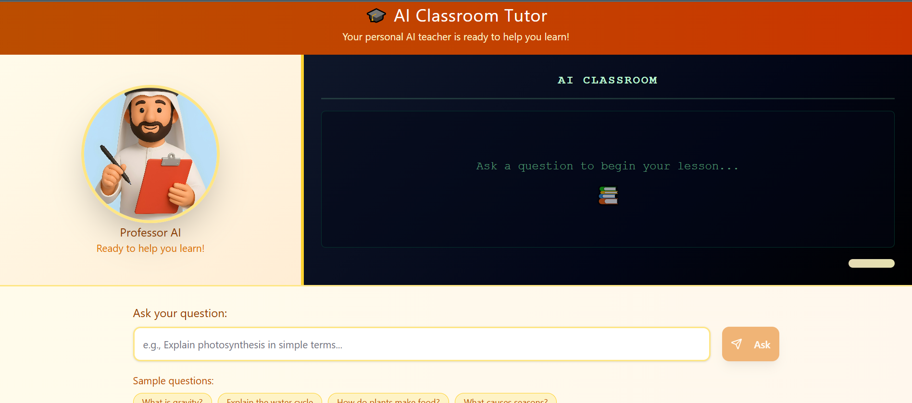
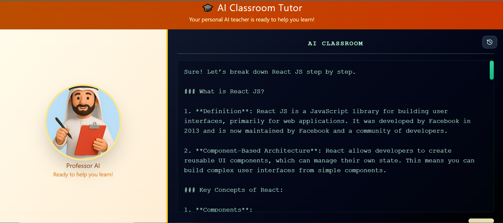

# 🎓 AI Tutor – Assessment Project

An interactive **AI-powered tutor** built with **React + TailwindCSS**.
Students can ask questions in natural language, and the AI tutor:

1. **Explains the topic** (via GPT-generated text).
2. **Writes the explanation on a blackboard-style UI** with animated text.
3. **Speaks the explanation aloud** using TTS (text-to-speech).
4. **Optionally displays a talking avatar** (via D-ID API).

---

## 🚀 Features

* ✅ **React frontend** with TailwindCSS for styling.
* ✅ **Blackboard UI** with animated chalk-style text.
* ✅ **AI-powered explanations** using OpenAI GPT models.
* ✅ **Audio narration** with lip-sync (Web Audio API + TTS).
* ✅ **Talking avatar** (via D-ID API integration).
* ✅ Scrollable blackboard text (long answers don’t overflow).
* ✅ Graceful error handling: text explanations always appear even if audio/video fail.

---

## 🖼️ Screenshots

### 1. Home Screen



### 2. Blackboard with Explanation



---

## 🛠️ Tech Stack

* **Frontend:** React, Vite, TailwindCSS
* **AI:** OpenAI GPT (text), OpenAI TTS or alternative
* **Avatar (optional):** D-ID API (video avatar generation)
* **Audio Processing:** Web Audio API for lip-sync effect
* **Server (optional):** Express.js (used for proxying D-ID API calls to avoid CORS issues)

---

## ⚙️ Setup

### 1️⃣ Clone the repo

```bash
git clone https://github.com/uk2459644/assessment-ai-tutor
cd ai-tutor
```

### 2️⃣ Install dependencies

```bash
npm install
```

### 3️⃣ Environment variables

Create a `.env` file in the root:

```env
VITE_OPENAI_API_KEY=your_openai_key_here
DID_API_KEY=your_did_key_here   # optional (for talking avatar)
```

⚠️ **Note:** For quick testing, we allowed using OpenAI API key in the browser (`dangerouslyAllowBrowser: true`). In production, always use a backend proxy.

### 4️⃣ Run the dev server

```bash
npm run dev
```

---

## 📖 Usage

1. Type a question in the input box.
2. The AI tutor will:

   * Show animated text on the blackboard.
   * Generate audio narration.
   * Optionally display a talking avatar (if D-ID is enabled).
3. Scroll inside the blackboard to view long answers.

---

## ⚠️ Limitations

* **Free tier limits**:

  * OpenAI API: free credits expire quickly, after which GPT answers & TTS won’t work.
  * D-ID API: limited free quota; once exhausted, avatar generation fails.
* **CORS issues**: D-ID API requires a backend proxy; direct browser calls may fail.
* **Latency**: Video/avatar generation can take several seconds.
* **Browser-only workaround**: Currently, API keys are exposed in the frontend (`dangerouslyAllowBrowser`). This is insecure for production.
* **Error handling**: If TTS or avatar fails, the **text explanation still works**, but no audio/video is produced.

---

## 📌 Future Improvements

* Add backend proxy to securely handle API keys.
* Cache explanations for repeated questions.
* Add multi-language support for explanations and TTS.
* Enhance avatar lip-sync realism.

---

## 📌 Hosted Demo
👉 [Live Assessment UI on Vercel](https://assessment-ai-tutor.vercel.app/)

---

## 👨‍💻 Authors

* Built as part of an **AI Tutor Assessment Project**.

---
"# assessment-ai-tutor" 
